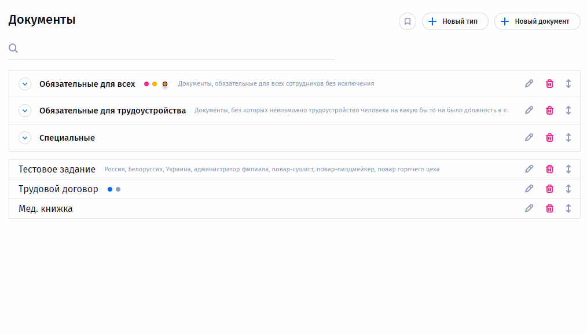

# Тестовый проект с использованием vuedraggable и поиска



### В данном проекте реализован только drag-and-drop и поиск. Блоки создания, редактирования, удаления - декоративные.


## Установите зависимости и запустите проект
```bash
npm i
```

```bash
npm run serve
```
